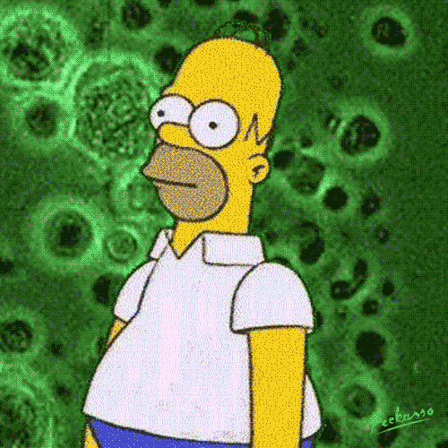

# Covid Detector

With this project, we aim to create a covid detection classifier which classifies the x-ray as covid or not covid. This may save time for the patient where the reports are being generated within 20-30 mins, the customer can upload the x-ray and get tentative results which the customer can use to take precautionary measures. 

Data - We have taken the <a href="https://www.kaggle.com/ahemateja19bec1025/covid-xray-dataset">Covid chest x-ray dataset</a> from Kaggle

Basically this is what we do 

And we are damn good at it  
<table>
<tr>
<td>Train</td>
<td>93.6%</td>
</tr>
<tr>
<td>Validation</td>
<td>93.1%</td>
</tr>
<tr>
<td>Test</td>
<td>94%</td>
</tr>
</table>